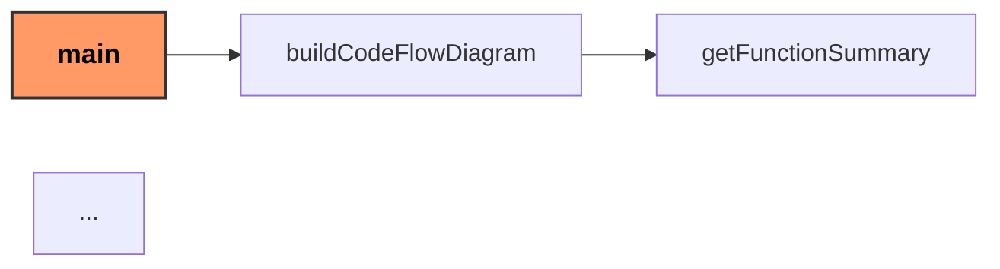

# 🧠 Code Flow Visualiser & Summariser (Go)

This tool parses Go source code, builds a **function call graph**, and generates a **Mermaid diagram** with function summaries using the OpenAI API.

---

## 🚀 Features

- 🔎 Parses Go source files
- 🧭 Extracts function calls and builds a flow graph
- 📝 Summarises each function using the OpenAI API
- 📄 Outputs a `codeflow.md` file with a Mermaid diagram for easy visualisation

---

## 🛠️ Setup

### 1. Clone the repo

```bash
git clone https://github.com/your-username/go-code-graph
cd go-code-graph
```

### 2. Install dependencies

```bash
go mod tidy
```

### 3. Create a .env file in the root directory

```bash
OPENAI_API_KEY=sk-proj-your-key-here
```

## Usage

```bash
go run main.go [path-to-go-code] [entry-function-name]
```

### Example

```bash
go run main.go ./example main
```

This will generate a file named codeflow.md with a Mermaid graph you can paste into:

[Mermaid Live](https://mermaid.live)

Markdown previewers with Mermaid support (e.g. VS Code with extension)

### Output



## Dependencies

[OpenAI API](https://platform.openai.com/)

[github.com/sashabaranov/go-openai](http://github.com/sashabaranov/go-openai)

[github.com/joho/godotenv](http://github.com/joho/godotenv)

## Author

Sammy-Jo Wymer :)
