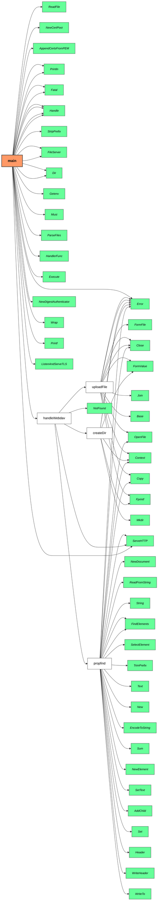

# Function Call Graph

```mermaid
graph LR
classDef entryFunc fill:#f96,stroke:#333,stroke-width:2px,font-weight:bold,font-size:18px,color:#000;
classDef leafFunc fill:#6f9,stroke:#333,stroke-width:1px,font-style:italic,font-size:14px,color:#000;
classDef normalFunc fill:#fff,stroke:#333,stroke-width:1px,font-size:16px,color:#000;
    main["main"]:::entryFunc
    main --> ReadFile
    ReadFile["ReadFile"]:::leafFunc
    main --> NewCertPool
    NewCertPool["NewCertPool"]:::leafFunc
    main --> AppendCertsFromPEM
    AppendCertsFromPEM["AppendCertsFromPEM"]:::leafFunc
    main --> Println
    Println["Println"]:::leafFunc
    main --> Fatal
    Fatal["Fatal"]:::leafFunc
    main --> Println
    main --> Handle
    Handle["Handle"]:::leafFunc
    main --> StripPrefix
    StripPrefix["StripPrefix"]:::leafFunc
    main --> FileServer
    FileServer["FileServer"]:::leafFunc
    main --> Dir
    Dir["Dir"]:::leafFunc
    main --> Handle
    main --> FileServer
    main --> Dir
    main --> Getenv
    Getenv["Getenv"]:::leafFunc
    main --> Must
    Must["Must"]:::leafFunc
    main --> ParseFiles
    ParseFiles["ParseFiles"]:::leafFunc
    main --> HandlerFunc
    HandlerFunc["HandlerFunc"]:::leafFunc
    main --> Execute
    Execute["Execute"]:::leafFunc
    main --> Error
    Error["Error"]:::leafFunc
    main --> handleWebdav
    handleWebdav["handleWebdav"]:::normalFunc
    handleWebdav --> uploadFile
    uploadFile["uploadFile"]:::normalFunc
    uploadFile --> FormFile
    FormFile["FormFile"]:::leafFunc
    uploadFile --> Error
    uploadFile --> Close
    Close["Close"]:::leafFunc
    uploadFile --> FormValue
    FormValue["FormValue"]:::leafFunc
    uploadFile --> Join
    Join["Join"]:::leafFunc
    uploadFile --> Base
    Base["Base"]:::leafFunc
    uploadFile --> OpenFile
    OpenFile["OpenFile"]:::leafFunc
    uploadFile --> Context
    Context["Context"]:::leafFunc
    uploadFile --> Error
    uploadFile --> Close
    uploadFile --> Copy
    Copy["Copy"]:::leafFunc
    uploadFile --> Fprintf
    Fprintf["Fprintf"]:::leafFunc
    handleWebdav --> createDir
    createDir["createDir"]:::normalFunc
    createDir --> FormValue
    createDir --> Error
    createDir --> Mkdir
    Mkdir["Mkdir"]:::leafFunc
    createDir --> Context
    createDir --> Error
    createDir --> Fprintf
    handleWebdav --> NotFound
    NotFound["NotFound"]:::leafFunc
    handleWebdav --> propfind
    propfind["propfind"]:::normalFunc
    propfind --> ServeHTTP
    ServeHTTP["ServeHTTP"]:::leafFunc
    propfind --> NewDocument
    NewDocument["NewDocument"]:::leafFunc
    propfind --> ReadFromString
    ReadFromString["ReadFromString"]:::leafFunc
    propfind --> String
    String["String"]:::leafFunc
    propfind --> Error
    propfind --> FindElements
    FindElements["FindElements"]:::leafFunc
    propfind --> SelectElement
    SelectElement["SelectElement"]:::leafFunc
    propfind --> TrimPrefix
    TrimPrefix["TrimPrefix"]:::leafFunc
    propfind --> Text
    Text["Text"]:::leafFunc
    propfind --> OpenFile
    propfind --> Context
    propfind --> Close
    propfind --> New
    New["New"]:::leafFunc
    propfind --> Copy
    propfind --> EncodeToString
    EncodeToString["EncodeToString"]:::leafFunc
    propfind --> Sum
    Sum["Sum"]:::leafFunc
    propfind --> FindElements
    propfind --> NewElement
    NewElement["NewElement"]:::leafFunc
    propfind --> SetText
    SetText["SetText"]:::leafFunc
    propfind --> AddChild
    AddChild["AddChild"]:::leafFunc
    propfind --> Set
    Set["Set"]:::leafFunc
    propfind --> Header
    Header["Header"]:::leafFunc
    propfind --> WriteHeader
    WriteHeader["WriteHeader"]:::leafFunc
    propfind --> WriteTo
    WriteTo["WriteTo"]:::leafFunc
    handleWebdav --> ServeHTTP
    main --> NewDigestAuthenticator
    NewDigestAuthenticator["NewDigestAuthenticator"]:::leafFunc
    main --> Handle
    main --> Wrap
    Wrap["Wrap"]:::leafFunc
    main --> ServeHTTP
    main --> Handle
    main --> Printf
    Printf["Printf"]:::leafFunc
    main --> Fatal
    main --> ListenAndServeTLS
    ListenAndServeTLS["ListenAndServeTLS"]:::leafFunc
```
