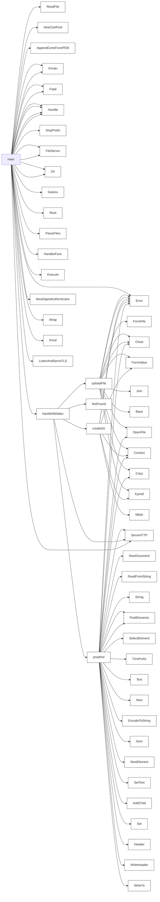

# Function Call Graph

```mermaid
graph LR
classDef bigFont fill:#fff,stroke:#333,stroke-width:1px,font-size:16px;
    main --> ReadFile
    ReadFile:::bigFont
    ReadFile:::bigFont
    main --> NewCertPool
    NewCertPool:::bigFont
    NewCertPool:::bigFont
    main --> AppendCertsFromPEM
    AppendCertsFromPEM:::bigFont
    AppendCertsFromPEM:::bigFont
    main --> Println
    Println:::bigFont
    Println:::bigFont
    main --> Fatal
    Fatal:::bigFont
    Fatal:::bigFont
    main --> Println
    Println:::bigFont
    main --> Handle
    Handle:::bigFont
    Handle:::bigFont
    main --> StripPrefix
    StripPrefix:::bigFont
    StripPrefix:::bigFont
    main --> FileServer
    FileServer:::bigFont
    FileServer:::bigFont
    main --> Dir
    Dir:::bigFont
    Dir:::bigFont
    main --> Handle
    Handle:::bigFont
    main --> FileServer
    FileServer:::bigFont
    main --> Dir
    Dir:::bigFont
    main --> Getenv
    Getenv:::bigFont
    Getenv:::bigFont
    main --> Must
    Must:::bigFont
    Must:::bigFont
    main --> ParseFiles
    ParseFiles:::bigFont
    ParseFiles:::bigFont
    main --> HandlerFunc
    HandlerFunc:::bigFont
    HandlerFunc:::bigFont
    main --> Execute
    Execute:::bigFont
    Execute:::bigFont
    main --> Error
    Error:::bigFont
    Error:::bigFont
    main --> handleWebdav
    handleWebdav:::bigFont
    handleWebdav --> uploadFile
    uploadFile:::bigFont
    uploadFile --> FormFile
    FormFile:::bigFont
    FormFile:::bigFont
    uploadFile --> Error
    Error:::bigFont
    uploadFile --> Close
    Close:::bigFont
    Close:::bigFont
    uploadFile --> FormValue
    FormValue:::bigFont
    FormValue:::bigFont
    uploadFile --> Join
    Join:::bigFont
    Join:::bigFont
    uploadFile --> Base
    Base:::bigFont
    Base:::bigFont
    uploadFile --> OpenFile
    OpenFile:::bigFont
    OpenFile:::bigFont
    uploadFile --> Context
    Context:::bigFont
    Context:::bigFont
    uploadFile --> Error
    Error:::bigFont
    uploadFile --> Close
    Close:::bigFont
    uploadFile --> Copy
    Copy:::bigFont
    Copy:::bigFont
    uploadFile --> Fprintf
    Fprintf:::bigFont
    Fprintf:::bigFont
    handleWebdav --> createDir
    createDir:::bigFont
    createDir --> FormValue
    FormValue:::bigFont
    createDir --> Error
    Error:::bigFont
    createDir --> Mkdir
    Mkdir:::bigFont
    Mkdir:::bigFont
    createDir --> Context
    Context:::bigFont
    createDir --> Error
    Error:::bigFont
    createDir --> Fprintf
    Fprintf:::bigFont
    handleWebdav --> NotFound
    NotFound:::bigFont
    NotFound:::bigFont
    handleWebdav --> propfind
    propfind:::bigFont
    propfind --> ServeHTTP
    ServeHTTP:::bigFont
    ServeHTTP:::bigFont
    propfind --> NewDocument
    NewDocument:::bigFont
    NewDocument:::bigFont
    propfind --> ReadFromString
    ReadFromString:::bigFont
    ReadFromString:::bigFont
    propfind --> String
    String:::bigFont
    String:::bigFont
    propfind --> Error
    Error:::bigFont
    propfind --> FindElements
    FindElements:::bigFont
    FindElements:::bigFont
    propfind --> SelectElement
    SelectElement:::bigFont
    SelectElement:::bigFont
    propfind --> TrimPrefix
    TrimPrefix:::bigFont
    TrimPrefix:::bigFont
    propfind --> Text
    Text:::bigFont
    Text:::bigFont
    propfind --> OpenFile
    OpenFile:::bigFont
    propfind --> Context
    Context:::bigFont
    propfind --> Close
    Close:::bigFont
    propfind --> New
    New:::bigFont
    New:::bigFont
    propfind --> Copy
    Copy:::bigFont
    propfind --> EncodeToString
    EncodeToString:::bigFont
    EncodeToString:::bigFont
    propfind --> Sum
    Sum:::bigFont
    Sum:::bigFont
    propfind --> FindElements
    FindElements:::bigFont
    propfind --> NewElement
    NewElement:::bigFont
    NewElement:::bigFont
    propfind --> SetText
    SetText:::bigFont
    SetText:::bigFont
    propfind --> AddChild
    AddChild:::bigFont
    AddChild:::bigFont
    propfind --> Set
    Set:::bigFont
    Set:::bigFont
    propfind --> Header
    Header:::bigFont
    Header:::bigFont
    propfind --> WriteHeader
    WriteHeader:::bigFont
    WriteHeader:::bigFont
    propfind --> WriteTo
    WriteTo:::bigFont
    WriteTo:::bigFont
    handleWebdav --> ServeHTTP
    ServeHTTP:::bigFont
    main --> NewDigestAuthenticator
    NewDigestAuthenticator:::bigFont
    NewDigestAuthenticator:::bigFont
    main --> Handle
    Handle:::bigFont
    main --> Wrap
    Wrap:::bigFont
    Wrap:::bigFont
    main --> ServeHTTP
    ServeHTTP:::bigFont
    main --> Handle
    Handle:::bigFont
    main --> Printf
    Printf:::bigFont
    Printf:::bigFont
    main --> Fatal
    Fatal:::bigFont
    main --> ListenAndServeTLS
    ListenAndServeTLS:::bigFont
    ListenAndServeTLS:::bigFont
```
